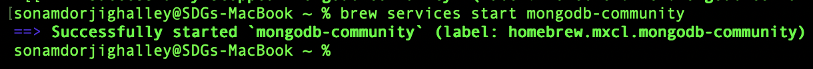

# Practical-6B

$$
\huge \begin{array}{c} \mathbf{\textsf{Royal University of Bhutan,}} \\ \mathbf{\textsf{College of Science and Technology}} \end{array}
$$

$$
\Large \mathbf{\textsf{Computing Technologies Department  }}

$$

$$
\Large \mathbf{\textsf{Practical 6B  }}
$$

$$
\large \mathbf{\textsf{Submitted by: Sonam Dorji Ghalley  }}
$$

$$
\large \mathbf{\textsf{Student No: 02230299  }}
$$

## 1. Introduction

Security around data stands as a central challenge today, especially while firms shift toward NoSQL systems for handling private records. Through hands-on work, we examine how key protections - like login verification, data scrambling, and permission tiers shaped by user roles - function within two common platforms: Redis and MongoDB.

Holding data in memory, Redis often supports tasks like caching, managing user sessions, or tracking live activity. MongoDB works differently - storing information as documents, which helps when dealing with evolving or unstructured formats. Security does not come turned on completely at first, even if speed and strength seem solid right after setup. One must step in early to adjust access controls and encryption settings before putting either system into actual service. Without these steps, risks increase quickly once deployment begins outside test environments.

One key part of this exercise looks at basic security rules. Getting access means proving identity, often done by entering a correct name and secret code. While moving between systems, information stays shielded using special protection known as TLS. This method stops outsiders from reading what is being sent. Instead of giving everyone full control, people get only the permissions they need for their tasks. Such limits follow a strict rule: minimum necessary access. What matters most is matching rights to roles, not individuals.

Built step by step, this lab walks through activating Access Control Lists alongside password checks in Redis - then layers in TLS to protect data moving across connections. Instead of stopping there, it moves into MongoDB setup: users gain verified access, tailored permissions are assigned, encryption secures transit. Afterward, inspection takes place - not just checking boxes but looking closely at what holds, where gaps linger, what could still go wrong. From that look, suggestions emerge based on real findings, not assumptions. Each stage connects, yet stands apart in purpose and outcome.

Finishing this session means walking away with two protected databases. A methodical way to check their security emerges alongside, ready for real-world use. One step follows another until clarity takes shape. Through each task, attention shifts toward patterns that professionals rely on. Instead of random checks, structure guides the process. What results is both tangible and repeatable. Experience builds not by accident, but through design.

## 2. Aim

To configure and verify authentication, encryption, and role-based access control for Redis and MongoDB, and to perform a basic security audit of the configured databases.

## 3. Objective

By the end of this practical, the student should be able to:

1. Enable password-based authentication and Access Control Lists (ACL) in Redis.
2. Enable TLS encryption for Redis connections (at least at the configuration and client-connection level).
3. Enable authentication and RBAC in MongoDB using built-in user roles and custom roles.
4. Enable TLS for MongoDB so that all traffic is encrypted in transit.
5. Execute a simple security audit checklist (tests and commands) for both databases and record findings.

### **3. Theory**

Authentication the process who checks if someone really is who they say they be? That happens before letting them touch a database. Redis uses passwords, along with something called **Access Control Lists** - first rolled out fully in version 6, then tweaked later in 7. Instead of one master key everyone shares, admins can now set up separate users, each with their own passcode. MongoDB turns on verification by flipping the security.authorization switch inside its config file. Once that's active, nobody does anything without handing over correct login details first. Leave it off, and both systems sit open to whoever finds the door on the network - that moment when trust becomes risk. So locking things down right away isn’t just smart - it’s where real protection begins.

When data moves between a client and a database, encryption during transfer keeps it safe from outside viewing or changes. Protection like this matters most if the connection runs across public or shared networks - places where messages can get intercepted. To block eavesdroppers, TLS guards that flow of information. For Redis, enabling secure links means pointing the config file to the right key and certificate locations, forcing all communication through an encrypted path. Rather than accepting open traffic, the system shuts out anything unencrypted once setup is complete. MongoDB takes a similar route - certificates go into mongod.conf so every exchange entering or leaving becomes shielded. Within practice setups, OpenSSL builds temporary certificates on demand instead of relying on official ones. These homemade files act just like the real thing while testing configurations ahead of live deployment. What you see here works exactly as it would later under actual trust chains. The stage mimics reality without needing external validation.

Security through roles means people get only what they need, nothing extra. Starting from zero trust, each role opens just enough doors. Commands in Redis stay locked unless someone has clearance by design. MongoDB handles this differently - roles come ready made, like read-only or full admin power. Custom jobs? Build new roles piece by piece. Access checks happen first, every time, before anything else runs. Encryption wraps data while moving and resting in place. Users prove who they are before any gate unlocks. Layered defenses stack up quietly, making breaches far less likely. Minimum access becomes the rule, not the exception.

## 4. Procedure

### Step 1: Start MongoDB Without Auth (Initial Setup Only)

let’s star the mongoDB server without authentication

```bash
brew services start mongodb-community
```



In another shell we run the following command to use the CLI for mongoDB

```bash
mongosh
```


Inside the mongosh shell we will create a new new user “admin” with its credentials

```bash
// Switch to admin database
use admin;

// Create admin user with full privileges
db.createUser({
  user: "rootAdmin",
  pwd: "rootStrongPwd",  // Use a strong password
  roles: [
    { role: "userAdminAnyDatabase", db: "admin" },
    { role: "dbAdminAnyDatabase", db: "admin" },
    { role: "readWriteAnyDatabase", db: "admin" }
  ]
});

// Verify user was created
db.getUsers();
```


This user will be used later to create other roles and users once auth is enabled.

Exit from mongosh

```bash
exit
```

### Step 2: Enable Authentication in `mongod.conf`

The mogod.congf file is located at `/opt/homebrew/etc/mongod.conf` 

Before editing the file it looks something like this 


after enabling the file we will see the file something like this

```bash
systemLog:
  destination: file
  path: /opt/homebrew/var/log/mongodb/mongo.log
  logAppend: true

storage:
  dbPath: /opt/homebrew/var/mongodb

net:
  bindIp: 127.0.0.1
  port: 27017

security:
  authorization: "enabled"
```

Now restarting the mongoDb server again

```bash
# Stop MongoDB
brew services stop mongodb-community

# Start it again with auth enabled
brew services start mongodb-community
```

Now let’s test the in the mongsh if the authentication is enabled or not


Connecting with admin credentials (should succeed):

```jsx
mongosh --host 127.0.0.1 --port 27017 \
  -u rootAdmin -p rootStrongPwd \
  --authenticationDatabase admin
```

Verify your connection:

```jsx
// Check your authenticated user

db.runCommand({ connectionStatus: 1 });

```


### Step 4: Create Application Database, Role, and User (RBAC)

Still connected as `admin` , we will  create application-specific permissions:

```jsx
// Create and use the application database
use myapp;

// Create a custom role for the application
db.createRole({
  role: "myAppRole",
  privileges: [
    {
      resource: { db: "myapp", collection: "customers" },
      actions: ["find", "insert", "update", "remove"]
    }
  ],
  roles: []  // No inherited roles
});

// Create an application user with this role
db.createUser({
  user: "appUser",
  pwd: "appStrongPwd",
  roles: [
    { role: "myAppRole", db: "myapp" }
  ]
});

// Verify the user was created
db.getUsers();
```


opening a new terminal and testing the RBAC, connecting a user appUser:

```jsx
mongosh --host 127.0.0.1 --port 27017 \
  -u appUser -p appStrongPwd \
  --authenticationDatabase myapp
```

Testing allowed operations:

```jsx
// Switch to myapp database
use myapp;

db.customers.insertOne({ name: "Student One", city: "Phuntsholing" });
// Output: { "acknowledged" : true, "insertedId" : ObjectId("...") }

db.customers.find();
// Output: Shows the inserted document

// This should FAIL (appUser has no access to admin)
use admin;
db.system.users.find();

```


### **Step 6: Enable TLS Encryption**

Generate Self-Signed Certificates in the `/opt/homebrew/etc`  directory:

```bash
# Create directory for certificates
mkdir mongodb-tls
cd mongodb-tls

# Generate CA key and certificate
openssl genrsa -out ca.key 4096
openssl req -new -x509 -days 1826 -key ca.key -out ca.pem \
  -subj "/C=BT/ST=Chukha/L=Phuntsholing/O=DBS302/OU=Lab/CN=MongoDB-CA"

# Generate server key
openssl genrsa -out mongodb.key 4096

# Generate certificate signing request
openssl req -new -key mongodb.key -out mongodb.csr \
  -subj "/C=BT/ST=Chukha/L=Phuntsholing/O=DBS302/OU=Lab/CN=localhost"

# Sign the certificate
openssl x509 -req -in mongodb.csr -CA ca.pem -CAkey ca.key -CAcreateserial \
  -out mongodb.crt -days 365 -sha256

# Create server PEM file (certificate + key)
cat mongodb.crt mongodb.key > server.pem
```


Updating `mongod.conf` to enable TLS:

for now the `mongod.conf` file looks something like this 

```yaml
systemLog:
  destination: file
  path: /opt/homebrew/var/log/mongodb/mongo.log
  logAppend: true

storage:
  dbPath: /opt/homebrew/var/mongodb

net:
  bindIp: 127.0.0.1
  port: 27017

security:
  authorization: "enabled"
```

now lets update it

```yaml
systemLog:
  destination: file
  path: /opt/homebrew/var/log/mongodb/mongo.log
  logAppend: true
storage:
  dbPath: /opt/homebrew/var/mongodb
net:
  bindIp: 127.0.0.1, ::1
  ipv6: true
  tls:
    mode: requireTLS
    certificateKeyFile: /Users/sonamdorjighalley/mongodb-tls/server.pem
    CAFile: /Users/sonamdorjighalley/mongodb-tls/ca.pem
    allowConnectionsWithoutCertificates: true  # For lab only
security:
  authorization: "enabled"
```

after updating the file lets restart the server

```bash
brew services restart mongodb-community
```

now connecting with TLS:

```bash
mongosh --tls \
  --tlsCAFile /opt/homebrew/etc/mongodb-tls/ca.pem \
  --host localhost \
  --port 27017 \
  -u appUser \
  -p appStrongPwd \
  --authenticationDatabase myapp
```


Verifying connection:

```jsx
use myapp;
db.customers.insertOne({ name: "TLS Test", city: "Thimphu" });
db.customers.find();
```


## Conclusion

A hands-on test showed MongoDB gains protection using login checks, assigned roles for users, then adding encrypted connections via TLS. With security.authorization turned on inside `mongod.conf`, plus setting up an admin account prior to flipping access rules live, the system shut out every unknown connection right away. When someone tried logging in empty-handed no username, no password, the outcome proved the lock worked tight; each move toward data got rejected flat. Only real logins moved forward after that.

Security around the MongoDB setup improved once RBAC got put into place. A tailored role named myAppRole came next, its reach restricted only to the myapp.customers data set. That role went straight to appUser, keeping permissions tight and focused. From there, allowed actions - reading and writing - worked without issue on the right collection. Attempts at touching the admin database? Shut down clean every time. Same result when reaching for unrelated collections - no entry granted. Each test backed up what was hoped: boundaries held firm. When roles take shape with care, separation works exactly how it should.

Midway through setup, encryption covered every bit moving between user devices and the MongoDB system. With self-made security files built via OpenSSL, plus a strict requireTLS rule placed into mongod.conf, unprotected attempts got shut down. Only those arriving with proper digital keys moved forward. At no point did private details - logins, records, anything - travel without shielding across the wires.

Most of the time, this practical showed MongoDB can be secure if set up right. Yet it won’t protect itself out of the box - someone must turn on key settings first. In live systems, better safety comes from limiting IP access just to known sources. Instead of homemade SSL certs, using ones from an official issuer adds trust. Watching every move in the database helps catch odd behavior later. Stronger rules for passwords also make break-ins harder to pull off.